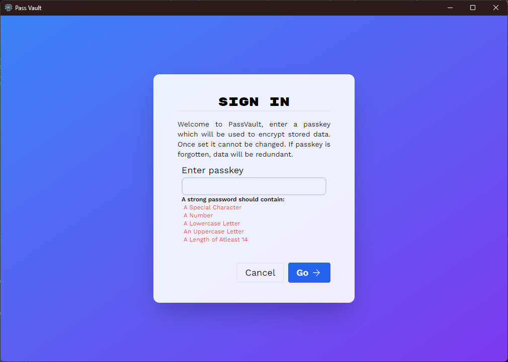
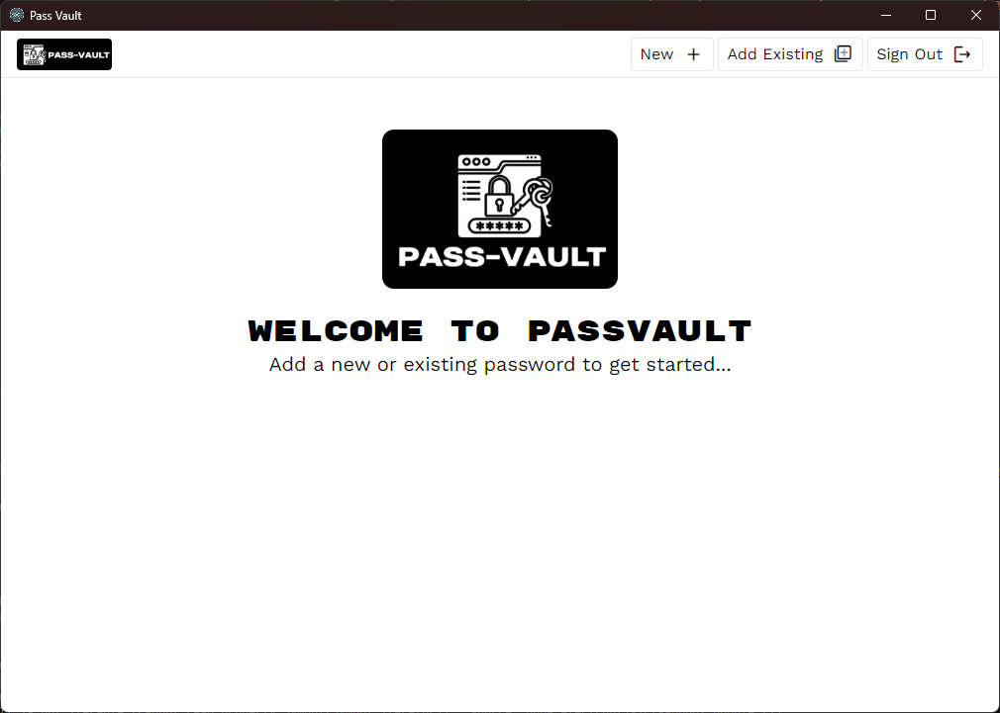
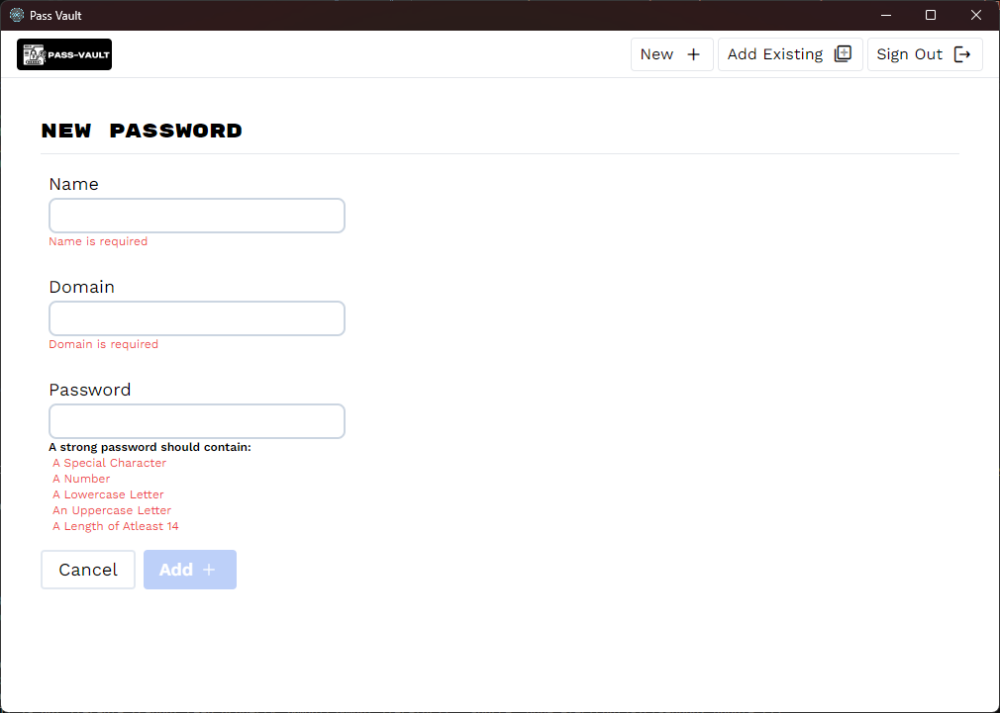
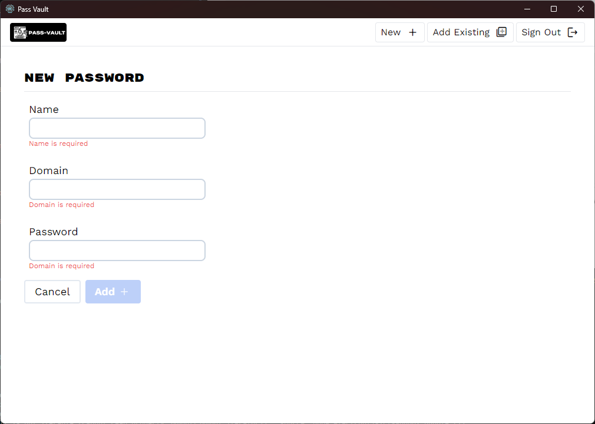
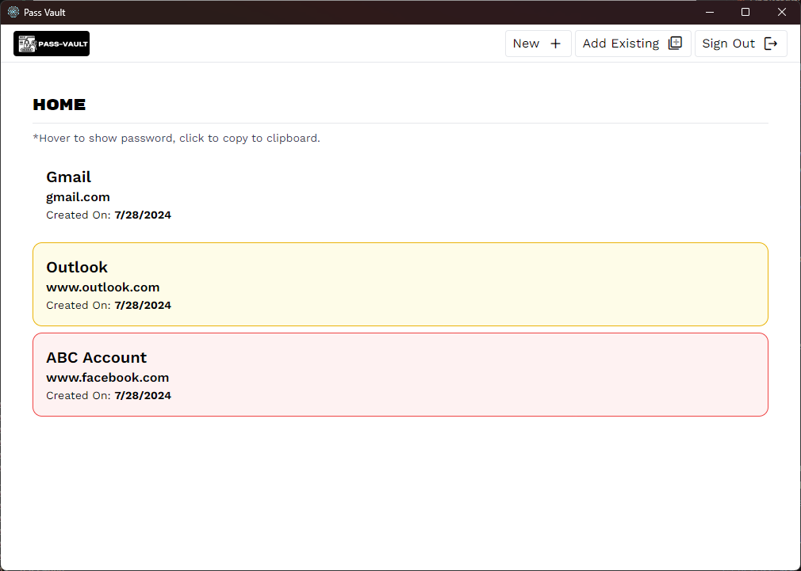

# PASS-VAULT


**PASS-VAULT** is a personal password manager application built using the electron-boilerplate-react framework. It is designed to help users securely store and manage their passwords. The application ensures the highest level of security by encrypting stored passwords using SQLite3, Sequelize ORM, and sequelize-encrypted package with user-provided passkeys.

## Features

- **Encryption**: The passwords are encrypted using a user-provided passkey. The encryption and decryption processes are handled by sequelize-encrypted.
- **Random Password Generation**: Generate strong and random passwords to enhance your security.
- **Password Validation**: Check if the entered password meets the required standards of complexity and strength.
- **Add New Passwords**: Easily add new passwords to your vault.
- **Update Existing Passwords**: Update or modify existing passwords stored in your vault.
- **Simple Sign-Out**: Securely sign out of the application with a single click.
- **Password Strength Check**: Evaluate and display the strength of your passwords to ensure they are strong and secure.

### Libraries Used

- **React**: A JavaScript library for building user interfaces.
- **Electron**: A framework for creating native applications with web technologies like JavaScript, HTML, and CSS.
- **Tailwindcss**: For styling the application interface.
- **Node.js**: JavaScript runtime built on Chrome's V8 JavaScript engine.
- **SQLite3 NPM library**: A self-contained, high-reliability, embedded, full-featured, public-domain, SQL database engine.
- **Sequelize ORM**: A promise-based Node.js ORM for Postgres, MySQL, MariaDB, SQLite, and Microsoft SQL Server.
- **sequelize-encrypted NPM library**: A Sequelize plugin to add encrypted fields to models.

# Installation:
### For Windows
Download the Setup executable file from the releases page and run.
### For linux or macOS (Build from source)
Clone the repository
```
git clone --depth 1 --branch main https://github.com/GenXHackers/pass-vault.git your-project-name
cd your-project-name
npm install
```
or Install source code from Version 1.0.0 Release
Package the application for your OS
```
npm run package
```
# Usage
1. A passkey is prompted initial app use.


2. Welcome Page


3. New Password page


4. Existing Password Page


4. Home Page


## License

This project is licensed under the GPL-2.0 License.

## Contributions

We welcome contributions to improve PASS-VAULT.
If you encounter any bugs or issues, please report them using the issue tracker.. Provide as much detail as possible, including steps to reproduce the issue and any relevant logs or screenshots.
We are always looking for ways to improve PASS-VAULT. If you have any feature requests, please submit them through the issue tracker Be sure to include a clear description of the feature and why you think it would be beneficial.
